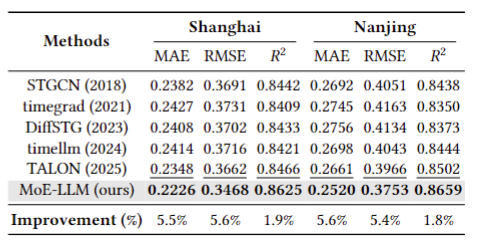

# MoE-LLM: A Hybrid Ensemble Framework Combining Mixture of Experts and LLM-Agent for Traffic Flow Prediction

## Abstract

Accurate traffic flow prediction is critical for the construction of smart cities and the development of intelligent transportation systems. However, existing approaches face several significant challenges: Single model structures struggle to capture multidimensional heterogeneous characteristics, static ensemble methods lack the ability to dynamically adapt to real-time spatiotemporal variations, existing prediction models offer no comprehensible reasoning for their decisions. This article proposes a Mixture-of-Experts framework enhanced by a Large Language Model (MoE-LLM) for traffic flow prediction to address the abovementioned challenges. First, we propose a Mixture-of-Experts (MoE) architecture comprising multiple specialized experts, each dedicated to capturing distinct traffic patterns. Second, we leverage an LLM to act as the experts coordination agent dynamically coordinating expert collaboration based on scene semantics, enabling adaptive ensemble to real-time spatiotemporal variations. Finally, we leverage the LLM's natural language reasoning capability to generate interpretable explanations alongside each prediction, achieving intrinsic explainability. Extensive experiments on real-world traffic datasets demonstrate that our proposed model surpasses state-of-the-art methods by over 5% in mobile traffic prediction.

## Framework

MoE-LLM consists of three core components that work collaboratively for traffic flow prediction:

**1. Temporal Experts**:Decompose traffic time series into three components:

\-Trend Expert: Linear model for long-term variations

\-Seasonal Expert: Fourier transform and LSTM network for periodic patterns

\-Residual Expert: Uses a diffusion-based model for probabilistic forecasting of irregular variations

**2. Spatial Experts:** Three spatial experts capture spatial dependencies by constructing graphs from complementary perspectives using spatio-temporal graph convolutional networks (STGCNs):

\-Distance-based STGCN: Constructs adjacency matrix based on Haversine distances between base stations, capturing spatial proximity impacts

\- Function-based STGCN: Builds adjacency matrix based on functional similarity between regions using POI distribution vectors, capturing urban functional dependencies

\- Pattern-based STGCN: Uses Pearson correlation to measure similarity between traffic time series, capturing regions with similar temporal patterns

3\. **Experts Coordination Agent (LLM-based)**: Central coordinator with two functions:

\-Semantic Traffic Prediction: The agent integrates preliminary predictions from all experts through structured context reasoning, synthesizing multiple perspectives into a coherent final prediction.

\-Adaptive Experts Coordination: After each prediction, the agent automatically evaluates expert performance and updates reliance scores based on prediction errors and spatial-temporal context.


## Installation

### Requirements

- Python 3.8+
- OpenAI API access (or compatible API endpoint)

### Dependencies

Install the required packages:

```bash
pip install -r requirements.txt 
```

## Usage

Take Shanghai as an example. Replace `shanghai` with `nanjing` for the Nanjing dataset.

### Step 1: Prepare data and pretrain expert models

```bash
python decompose.py                                                
# Obtain trend, seasonal, and residual components
python linear_trend_predictor.py                                
# Obtain the expert model for trend component ：Linear_trend.pt
python lstm_seasonal_predictor.py                             
# Obtain the expert model for seasonal component ：LSTM_seasonal.pt
python fourier_seasonal_predictor.py                         
# Obtain the expert model for seasonal component ：Fourier_seasonal.pt
bash /root/MoELLM/diffusion/run_train_shanghai.sh                                        
# Obtain the expert model for residual component ：residual.pt
python /root/MoELLM/data/prepare_geo.py              
# Obtain the geographical adjacency matrix
python /root/MoELLM/data/prepare_similarity.py      
# Obtain the similarity adjacency matrix
python generate_poi_json.py                                          
# Obtain base station POI information
python /root/MoELLM/data/prepare_poi.py                               
# Obtain the POI similarity adjacency matrix
```
### Step 2: Run prediction

```bash
bash test_shanghai.sh
```
For Nanjing, simply change the city name

## Project Structure

```
MoELLM/
├── data/
│   └── {city}/                          # nanjing / shanghai
│       ├── traffic.csv                  # Raw traffic flow data
│       ├── POI.csv                      # Point-of-interest data
│       ├── base_station.json            # Base station metadata
│       ├── adj_geo.npz                  # Geographic adjacency matrix
│       ├── adj_poi.npz                  # POI similarity adjacency matrix
│       ├── adj_similarity.npz           # Traffic pattern similarity matrix
│       ├── prepare_geo.py               # Build geographic adjacency
│       ├── prepare_poi.py               # Build POI adjacency
│       └── prepare_similarity.py        # Build similarity adjacency
├── diffusion/                           # Residual expert (DiffSTG)
│   ├── algorithm/diffstg/               # DiffSTG model implementation
│   ├── utils/                           # Training utilities
│   ├── train.py                         # Diffusion model training
│   ├── run_train_shanghai.sh            # Training script for Shanghai
│   └── run_train_nanjing.sh             # Training script for Nanjing
├── script/
│   ├── dataloader.py                    # Data loading and batching
│   ├── earlystopping.py                 # Early stopping callback
│   ├── opt.py                           # Optimizer configuration
│   └── utility.py                       # Training utility functions
├── model/
│   ├── models.py                        # STGCN spatial expert models
│   └── layers.py                        # Graph convolution layers
├── decompose.py                         # Time series decomposition
├── linear_trend_predictor.py            # Trend expert (Linear)
├── lstm_seasonal_predictor.py           # Seasonal expert (LSTM)
├── fourier_seasonal_predictor.py        # Seasonal expert (Fourier)
├── expert_loader.py                     # Load pretrained expert models
├── ensemble_predictor.py                # MoE ensemble prediction
├── llm_agent.py                         # LLM-based coordination agent
├── utils.py                             # Shared utility functions
├── generate_poi_json.py                 # Generate POI JSON from raw data
├── main.py                              # Main entry point
├── test_shanghai.sh                     # Evaluation script for Shanghai
├── test_nanjing.sh                      # Evaluation script for Nanjing
├── requirements.txt                     # Python dependencies
├── framework.png                        # Framework diagram
├── result.png                           # Performance results
└── readme.md                            # This file
```

## Results

MoE-LLM demonstrates superior performance across multiple metrics, achieving **>5%** improvements in both MAE and RMSE.



## License

This project is for research purposes only.